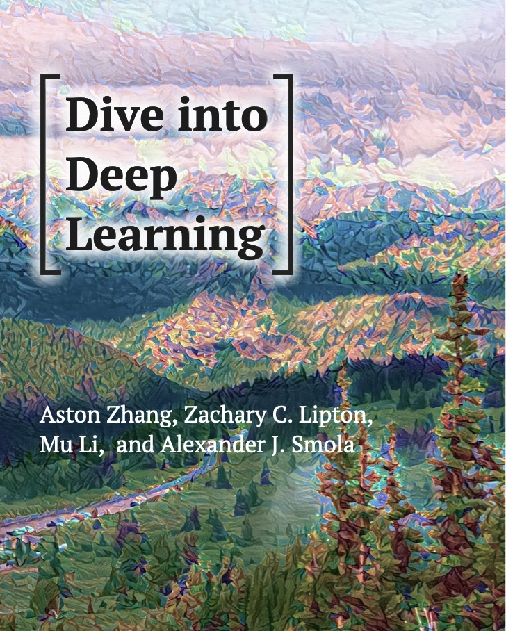

# 《深度学习》花书资源一览
看专业书籍不配参考资料，好像买单反不配镜头

## 英文资料
* 图书官网 (不提供图书整本pdf,需要自己分章节转换)
    * https://www.deeplearningbook.org/
* MIT Deep Learning Book (beautiful and flawless PDF version)
    * https://github.com/janishar/mit-deep-learning-book-pdf
## 中文资料
* 同济子豪兄狂撸花书
    * https://www.bilibili.com/video/BV1kE4119726/
* 花书中文全书
    * https://github.com/exacity/deeplearningbook-chinese
* 朱明超-花书原理推导与代码实现
    * https://github.com/MingchaoZhu/DeepLearning
* 读书笔记(川陀学者知乎笔记)
    * 分章节笔记。尤其是16-20章笔记，深度概率模型、深度生成模型最好的笔记
    * https://zhuanlan.zhihu.com/p/38431213
## 配套在线课程
* CS231n Convolutional Neural Networks for Visual Recognition
    * 官网 http://cs231n.stanford.edu/
    * 平替(子豪精讲) https://www.bilibili.com/video/BV1K7411W7So
* CS224n CS224n: Natural Language Processing with Deep Learning
    * 官 http://web.stanford.edu/class/cs224n/
    * 平 https://www.bilibili.com/video/BV1pt411h7aT/
* CS229 Machine Learning
    * 官 https://cs229.stanford.edu/
    * 平 https://www.bilibili.com/video/BV1iK411W7p9
* CS236 Deep Generative Models
    * 官 https://deepgenerativemodels.github.io/
    * 平 https://www.bilibili.com/video/BV1SJ411b7D8
* CS294-158 
    * 官 https://www2.eecs.berkeley.edu/Courses/CS294_3403/
    * 平 https://www.bilibili.com/video/BV1Eb411Y7J5
* CMU 10-708 Probabilistic Graphical Models
    * 官 https://www.cs.cmu.edu/~epxing/Class/10708-20/index.html
    * 平 https://www.bilibili.com/video/BV1tX4y1371G
* CS6748 Advanced Topics in Machine Learning
    * 官 https://kuleshov.github.io/ornell-deep-generative-models-course/
    * 平 
## Coding 
Dive into Deep Learning《动手学深度学习》

* MXNET→Pytorch
    * PDF https://github.com/ShusenTang/Dive-into-DL-PyTorch
    * code https://github.com/shazhongcheng/machine_learing_study
    * 讲解 https://www.bilibili.com/video/BV1HJ41177E9/

    

